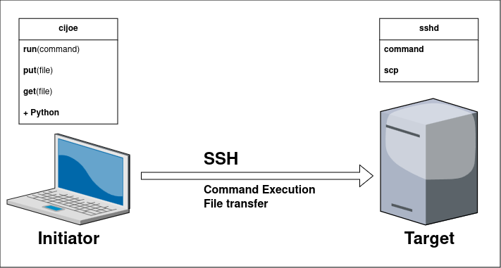

.. _sec-prerequisites:

Prerequisites
=============

**TLDR;** To install and run **cijoe**, the requirements are:

* **initiator**: :python:`Python <>` and :pipx:`pipx <>`
* **target**: ssh-server

The diagram below illustrates what the **initiator** and **target** systems
cover.

   The "core" agentless functionality of **cijoe**; run commands and tranfer
   files

.. _sec-prerequisites-initiator:

Initiator
---------

The **initiator** is the system where the **cijoe** command-line tool is invoked
and the **cijoe** scripts are being executed, requiring :python:`Python <>`
along with the necessary :python:`Python <>` package dependencies. With the
adoption of :pep668:`PEP 668 <>` by Linux distributions, providing a virtual
environment for Python packages is now mandatory rather than a recommended
practice.

For command-line utilities, :pipx:`pipx <>` offers a convenient way to install
tools within a :python:`Python <>` virtual environment (venv), ensuring the
correct environment variables are set for CLI endpoints to function properly.
Therefore, the initiator must meet the following requirements:

* :python:`Python <>` >= 3.9
* :pipx:`pipx <>`

It is recommended to install :python:`Python <>` and :pipx:`pipx <>` via
the package manager of the **initiator** system. To ensure that **pipx** is
correctly, then run the following:

.. code-block:: shell

  pipx ensurepath

.. note::
  The **initiator** uses a pure-Python (3.6+) implementation of the SSHv2
  protocol (:paramiko:`Paramiko <>`), thus, it does not interfere with your
  existing **SSH** setup and does not rely on system crypto/ssl libraries.

After running this, reload your environment by either logging out completely or
starting a new shell session. With :python:`Python <>` and :pipx:`pipx <>` in
place, then install **cijoe**::

  pipx install cijoe --include-deps

Check that it installed correctly, by invoking the **cijoe** command-line tool:

.. literalinclude:: ../050_usage_help.cmd
   :language: console

You should then see:

.. literalinclude:: ../050_usage_help.out
   :language: console

With this in place, then go ahead and check up on
your :ref:`sec-prerequisites-target` configuration.

.. _sec-prerequisites-target:

Target
------

The **target** is where **commands** are executed via **ssh** and files
are transferred using **scp**, both of which must be properly installed and
configured. As an agentless system, **cijoe** is minimally intrusive and thus
require no additional software installation on the **target**.

However, **cijoe** assumes certain conditions in the environment. To simplify
specific tasks, this section outlines these assumptions and provides the
necessary tweaks.

* You can access the **target** system from the **initiator** via **SSH**

  - E.g. test that you can ``ssh foo@example``
  - You setup your **ssh** credentials in the **cijoe** config file
  - The **ssh** credentials on your system is **not** re-used

This means that the following is available on the **target**:

* sshd (e.g. openssh-server)

  - This is considered **agentless** since it is not specific to **cijoe** and
    it is generally available, even on :windows_ssh:`Windows <>`.

* scp

  - This comes with the sshd installation

* The **commands** you specify must exist

  - It is recommended to **not** use shell-specific commands, as doing so
    will reduce script portability. Additionally, advanced shell functionality
    is usually unnecessary since Python capabilities are available on the
    **initiator** side where your **cijoe** script is executing. Therefore, keep
    commands simple.
    
  - If you run a benchmark suite, then install it first. **cijoe** can help you
    do so by writing a **cijoe** script that does the installation of the tool,
    transfer it with ``cijoe.put()`` and ``cijoe.run()`` to invoke installation.
    Or you can use some other means of **provisioning**.

.. _sec-prerequisites-target-setup:

Target Setup
------------

The following subsections describe system setup / configuration of the target
**system**.

.. _sec-prerequisites-target-config-user:

user
~~~~

These configurations would be considered **unsafe** had they been for a
production environment facing the public internet. However, do keep in mind that
the **target** system will often be a system spun up in an **adhoc** fashion
inside a DevOps infrastructure, cloud-service, or a local lab.

Should you be using a **target** system where ``root`` login over
**ssh** is not acceptable, then you can use a **non-root** user
with :ref:`sec-prerequisites-target-config-sudo`.

Or simply use a **non-root** user and do not run any **commands** requiring
elevated privileges. In such a scenario, then request permission for your user
to certain devices and tools that you need.

.. _sec-prerequisites-target-config-sshd:

sshd login
~~~~~~~~~~

The following are a couple of sshd settings that it is recommended that you
apply, the configuration file is usually available at e.g.
``/etc/ssh/sshd_config``:

.. code-block:: shell

  PermitRootLogin yes
  PasswordAuthentication yes

These options enable, as their names suggest, the ability to log in with the
``root`` user, and to use **password** authentification. These options are
disabled by default since it can be considered **dangerous** if for instance the
machine is facing the public internet.

.. _sec-prerequisites-target-config-sudo:

Passwordless sudo
~~~~~~~~~~~~~~~~~

There are also scenarios, where you want to execute using a **non-root** user.
In such cases, having **sudo** capabilities is desirable. For the user named
``foo``, then invoke ``visudo`` and add a line such as:

.. code-block:: shell

  foo ALL=(ALL) NOPASSWD: ALL

Allowing the ``foo`` user to run ``sudo`` without being prompted for a
password can be especially useful when automating commands. This avoids the
need for additional tools or scripting workarounds, such as those relying
on :expect:`expect-like <>` functionality. By bypassing the password prompt,
you simplify the process of running commands in scripts that require elevated
privileges.
