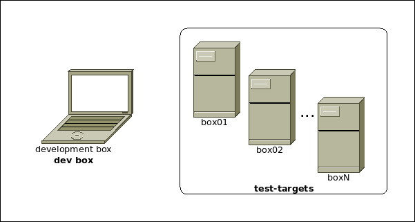

.. _sec-introduction:

==============
 Introduction
==============

A network-connected **development environment**, as illustrated in
:numref:`devenv`, typically consists of a box on which **changes** are created
using editors/IDEs/Toolchains for the task at hand, we refer to such a machine
as the **dev box**.
Said **changes** are then deployed for testing on one or more
boxes/VMs/systems, we refer to the latter as **test-targets**.

With **cijoe** you create an :ref:`sec-environment` for each of available
**test-target**. Thus, when you are e.g. :ref:`sec-running`, then you can
easily switch **test-target** by providing a different :ref:`sec-environment`.

.. _devenv:

   Development environment containing a **dev box**, and multiple **test-targets**.

The sections :ref:`sec-prerequisites` and :ref:`sec-installation`  describe
what is needed on your **dev box** and your **test-target(s)**.

.. note:: An :ref:`sec-environment-example` **environment definition** for a
   **test-target** named ``box01`` is used throughout the documentation, such
   as in the examples of :ref:`sec-running` and dropping into the
   :ref:`sec-shell`.

Once you have ensured that :ref:`sec-prerequisites` are met, have gone through
the :ref:`sec-installation`, and created your :ref:`sec-environment`, then you
have the basics in place and you can start :ref:`sec-running`, generate reports
using the :ref:`sec-post-processing-reporter`, extract **metrics** of interest
using the :ref:`sec-post-processing-extractor` and feed extracted metrics to
the :ref:`sec-post-processing-analyser` for evaluation and
:ref:`sec-post-processing-plotter` to produce graphs.

In addition to the command-line tools described in the sections above, then
**cijoe** and **cijoe packages** provide Bash-modules, you can familiarize
yourself with these by using the :ref:`sec-shell` and have a look at how to do
:ref:`sec-provisioning`, of your **test-target(s)**, and integrate **cijoe** in
**CI/CD** systems using the :ref:`sec-provisioning-snippet` and glue together
tasks in your workflow as outlined in the :ref:`sec-provisioning-script`.

After going through the sections described above, then you should have gotten a
feel for **cijoe** and you can start :ref:`sec-packages` for your project(s).
At this point it is likely that you have stumbled accross things you find are
wrong, annoying, or for other reasons you would like to change. In that case
then feel free to create a pull-request with your changes on `GitHUB`_.

.. _GitHUB: https://github.com/refenv/cijoe
